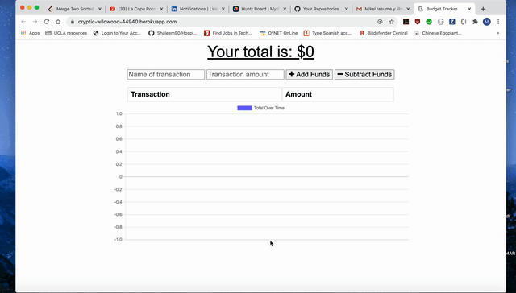

# Budget_Tracker WebApp

[Live App](https://cryptic-wildwood-44940.herokuapp.com/)

Track your expenses and deposits with our budget_tracker App. You'll be able to track your transactions even offline. When your app goes back online it will update all your information.

This app can be used as a browser app or native app.

# Technologies Used

1. mongoDB with mongoose
2. Node.js
3. Express
4. Javascript
5. HTML, CSS, Bootstrap
6. Morgan
7. IndexDB
8. Webmanifest / service-workers

# Table of Contents

* [Installation](#installation)
* [Instructions](#instructions)
* [Example Gif](#example-gif)
* [Author](#author)

## Installation
> 1.npm install

## Instructions
> Open your browser and go to [budget_tracker](https://cryptic-wildwood-44940.herokuapp.com/). From there, start adding your transactions and see your budget. You'll have access to graphs that explain your transactions. 
If you'd like to use this app as a native app and not in the browser, go to chrome tools and click "install budget_tracker".

## Example Gif

## Author 

**MikelTafalla**

Email: mikel362d@gmail.com

Location: Santa Barbara

GitHub: https://github.com/MikelTafalla

